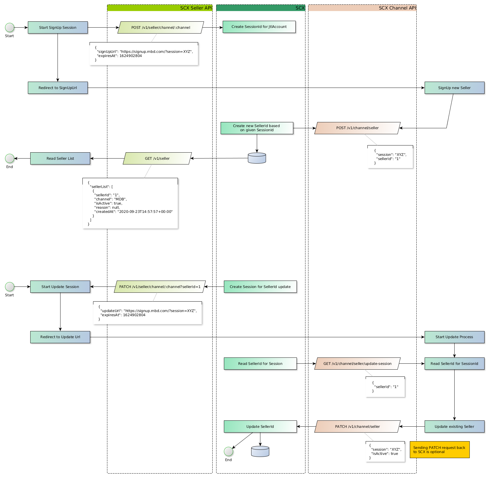
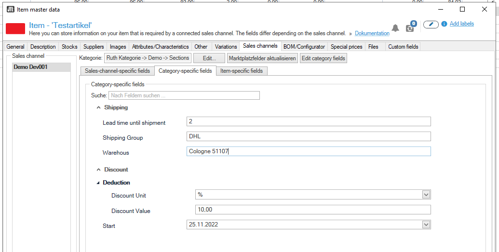
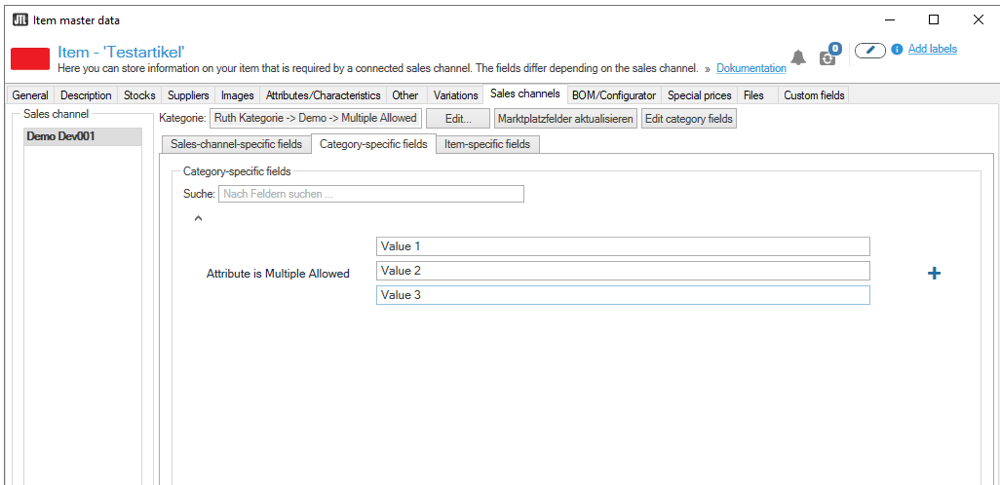
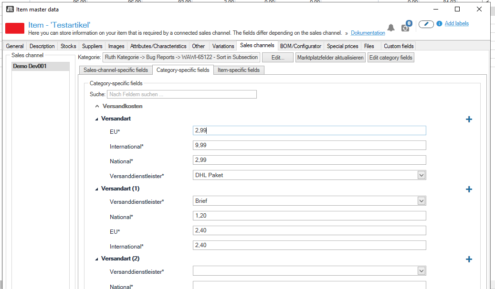
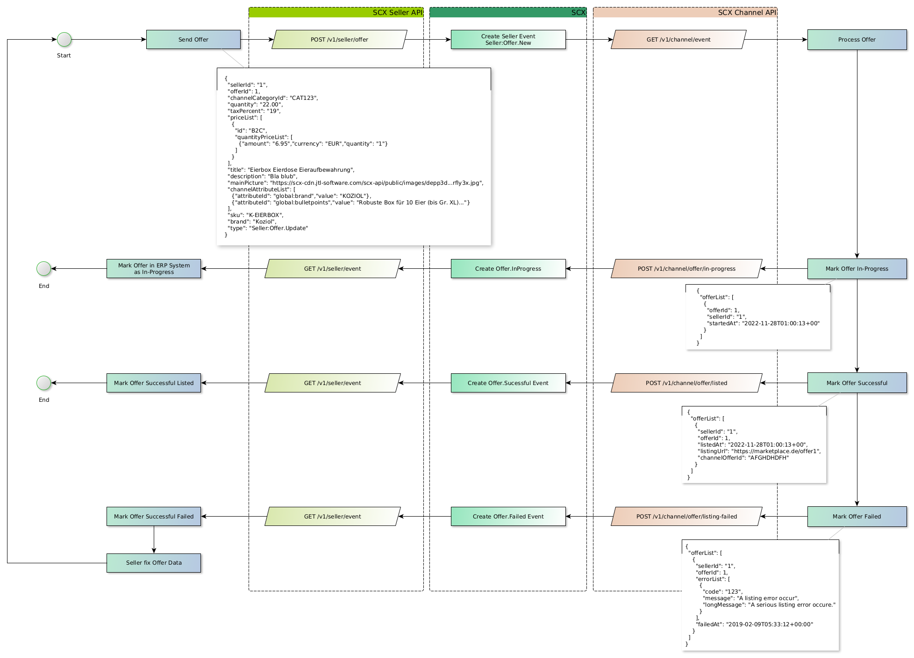
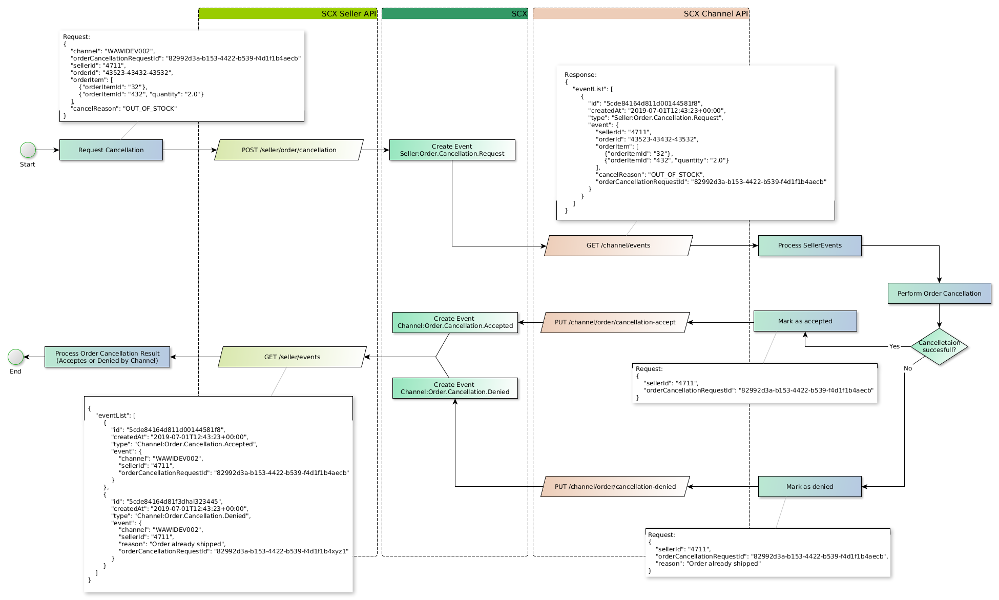
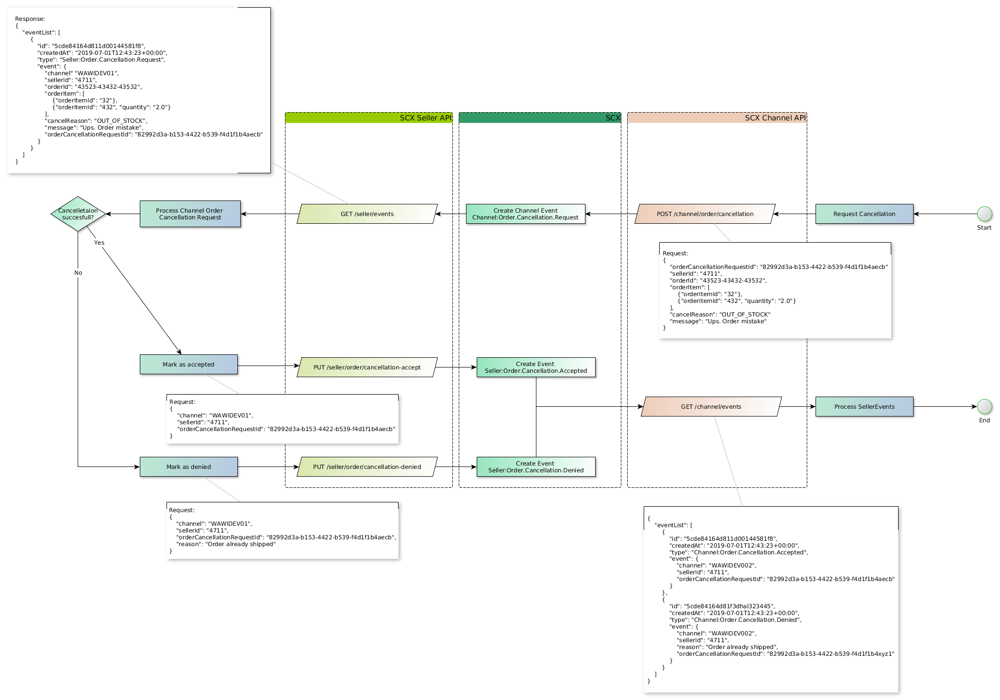
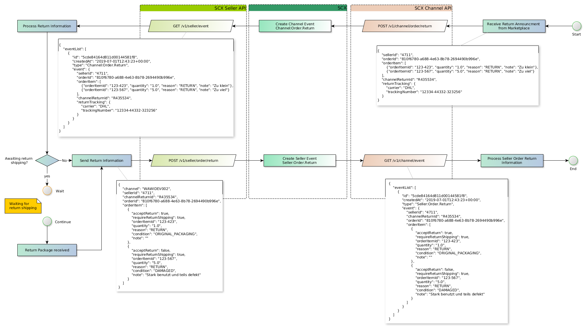
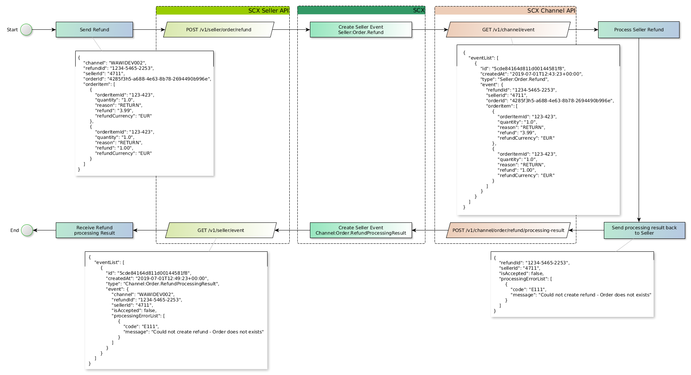

> The key words "MUST", "MUST NOT", "REQUIRED", "SHALL", "SHALL NOT", "SHOULD", "SHOULD NOT", "RECOMMENDED",  "MAY", and "OPTIONAL" in this document are to be interpreted as described in RFC 2119.

# Key Features

With the JTL-Channel API, you can:

-  Describe connected Marketplace Data Structure by providing Category and Attribute Data
-  Manage Product and Offer Listings
-  Update Price and Quantity of an Offer Listing
-  Manage Orders
-  Handle the Post Order Process (Return, Refund)

Target Audience:

* Marketplaces who want to connect with Sellers using JTL-Software with an eazyAuction Subscription
* Software Developer who want to build a connection to a Marketplace

# Terminology

- **Channel**: A Channel is a connection to a Marketplace or any external System which can be connected to JTL-Channel API.
-  **Seller**: A Seller is a person – identified by an unique ID (SellerId) – who want to offer and sells his good on the connected Channel.
- **Event**: A Event is an action initiated from a Seller. A Channel need to react on those Events in order to create or update an Offer or to process some Post Order actions.
- **Seller API**: This is the counterpart for the Channel API. The ERP System JTL-Wawi is connected with the Seller API.


# Seller Management

A Channel need to manage their Seller Accounts by itself. JTL will never be aware of any credentials which are required by individual Seller to connect to certain Marketplace or external System (for example: API Credentials).

Each Channel must maintain a SignUp URL and Update URL. Those URLs pointing to a Login or Signup Page, hosted by the Channel itself. A Seller will create a SignUp or Update Session inside JTL-Wawi, which redirect the Seller together with a short-lived and unique SessionId to the Channel's hosted SignUp/Update URLs.



<div style="page-break-after: always; visibility: hidden">
\pagebreak
</div>

## Seller SignUp

The aim of the sign-up process is to avoid managing sensitive access data to a marketplace within the client environment or SCX. The channel itself has sovereignty over the access data to the connected marketplace.

- Channel has a SignUp URL
- A sign-up is initiated via the Seller-API
- The JTL-Wawi of the customer account redirects to the SignUp URL (via web browser).
- The destination of the SignUp URL is a website hosted by the channel. On this website the registration process takes place
- The channel registers and stores a new seller and assigns a unique SellerId.
- The channel reports the generated SellerId together with the SessionId back to SCX.
- SCX stores the SellerId to the channel and reports all events with this SellerId to the channel from now on.

### API Examples

Create a new SignUp SessionId

```json
// POST /v1/seller/channel/MYCHANNEL

{
  "signUpUrl": "https://www.mychannel.com/?session=demoSessionId123&expiresAt=1646759360",
  "expiresAt": 1646759360
}
```

Seller is now redirected to the `signUpUrl`.

On the SignUp Page, the Channel must ask for Seller identification. If a Seller is considered as valid and authenticated, the Channel itself must create a unique SellerId and send them together with the SessionId, from the SignUp URL to the Channel API.

**_Note_**: All Events received from the Channel API will have this SellerId. This SellerId is immutable and can not be changed afterwards.

```json
// POST /v1/channel/seller 

{
  "session": "demoSessionId123",
  "sellerId": "1",
  "companyName": "JTL-Software-GmbH"
}
```

<div style="page-break-after: always; visibility: hidden">
\pagebreak
</div>

## Seller Update

From time to time, it may be necessary for a JTL-Account to update the connection to its Seller. For example, the access data to the marketplace may have been renewed. In this case, the JTL account must be able to update this data on the channel.

- Channel has an Updated URL defined.
- An update process is initiated using the Seller API.
- The client of the JTL Account (JTL-Wawi) redirects the User to the update URL
- The target of the update URL is a website hosted by the channel. On this website the update process takes place
- The channel asks SCX which SellerId belongs to the current update SessionID.
- The channel enables an update of the seller
- After the update process, the channel can also update the seller on the SCX system.

### API Examples

Seller update process in initiated by creating an Update URL for Channel


```json
// PATCH /v1/seller/channel/MYCHANNEL?sellerId=1
 
{
  "updateUrl": "https://www.mychannel.com/update?session=demoUpdateSessionId123&expiresAt=1646759360",
  "expiresAt": 1646759360
}
```

The Seller is redirected to the Update URL from the Channel, alongside with a short-lived SessionId.

For security reason, the SellerId is not part of the Update URL and can be received within a separate call.

```json
// GET /v1/channel/seller/update-session?sessionId=xyz

{
  "sellerId": "1"
}
```

After the update workflow is handed, the Channel may now update the Seller at Channel API.

```json
// PARTH /v1/channel/seller


{
  "sessionId": "demoUpdateSessionId",
  "isActive": true,
  "companyName": "JTL-Software-GmbH"
}
```

# Seller-Events

One important component of SCX are Seller and Channel Events. Seller Events are emitted by a Seller integration, such as JTL-Wawi, while Channel Events are emitted by a Channel Integration. Such events are actions created by an actor (Seller or Channel) and may be handled by connected integrations.

A Channel Integration needs to handle various Seller Events provided by `GET /v1/channel/events` in order to create new Offer listings, mark orders as paid or shipped.

It is recommended to call the Seller Event Endpoint in a regular interval (once a minute) and consume all Events available.

When a event is consumed, it must be acknowledged by calling `DELETE /v1/channel/events`. Otherwise, an Event will be retransmitted after a timeout.

Events will be transmitted maximum 10 times. Afterwards it will be marked as dead-lettered and will be not retransmitted again.

## API Examples

Receive Seller Events

```json
// GET /v1/channel/event

{
    "eventList": [
        {
            "id": "63623b997d2c89a4e3e9f3c7",
            "event": {
                "channel": "WAWIDEV001",
                "sellerId": "EA4590MitName"
            },
            "createdAt": "2022-11-02T09:42:49+00:00",
            "type": "Seller:Meta.SellerAttributesUpdateRequest"
        },
        {
            "id": "636280fd498628e9f0b28984",
            "event": {
                "sellerId": "1",
                "offerId": 822,
                "channelCategoryId": "CAT7",
                "quantity": "0",
                "taxPercent": "19",
                "priceList": [
                    {
                        "id": "B2C",
                        "quantityPriceList": [
                            {
                                "quantity": "1",
                                "amount": "19.99",
                                "currency": "EUR"
                            }
                        ]
                    }
                ],
                "title": "Fahrrad Halterung",
                "channelAttributeList": [
                    {
                        "attributeId": "WAWI-61427_number_category",
                        "value": "954",
                        "group": "0"
                    }
                ],
                "sku": "843609"
            },
            "createdAt": "2022-11-02T14:38:53+00:00",
            "type": "Seller:Offer.New"
        },
	]
}
```

Acknowledge previous received events.

```json
// DELETE /v1/channel/event

{
    "eventIdList": [
	    "63623b997d2c89a4e3e9f3c7",
        "636280fd65a66c4430ec0d67"
    ]
}
```
<div style="page-break-after: always; visibility: hidden">
\pagebreak
</div>

# Listing Process

In the SCX context, there is no concept of a product catalog. Only offer data is transmitted via the SCX interface, but this can contains detailed product data as well, if required by the Channel.

A Channel must provide descriptive Data to describe how an Offer Listing may look like on a connected Marketplace.

## Prices Types

There must be at lead one Price Type available to create a listing on a connected Marketplace. Examples for Price Types are B2C or B2B prices.

### API Example

```json
// POST https://scx-sbx.api.jtl-software.com/v1/channel/price

{
  "priceTypeId": "MarketplaceTypeId",
  "displayName": "Marketplace Price",
  "description": "Selling price on Marketplace"
}
```

The `priceTypeId` will be transmitted with the `Seller:Offer.New` or `Seller:Offer.Update` Seller Event. 

```json
{
  "sellerId": "1",
  "offerId": 4711,
  "channelCategoryId": "Stuff",
  "quantity": "508.00",
  "taxPercent": "19",
  "priceList": [
    {
      "id": "MarketplaceTypeId",
      "quantityPriceList": [
        {
          "amount": "6.95",
          "currency": "EUR",
          "quantity": "1"
        }
      ]
    }
  ],
  "...": "..."
}
```

<div style="page-break-after: always; visibility: hidden">
\pagebreak
</div>

## Category Tree

A connected Channel may provide a Category Tree to set specific Attributes related to a Category.

### API Examples

The API Endpoint is replacing the whole Category Tree.

```json
// PUT /v1/channel/categories

{
    "categoryList": [
        {
            "categoryId": "1",
            "displayName": "First Category",
            "listingAllowed": false,
            "parentCategoryId": "0"
        },
        {
            "categoryId": "1.1",
            "displayName": "First Leaf Category",
            "listingAllowed": true,
            "parentCategoryId": "1"
        },
        {
            "categoryId": "1.2",
            "displayName": "Second Leaf Category",
            "listingAllowed": true,
            "parentCategoryId": "1"
        }
	]
}
```

<div style="page-break-after: always; visibility: hidden">
\pagebreak
</div>


## Attributes

Attributes provide a very simple, but at the same time powerful, way to describe an offer for a channel. This allows the channel to define all marketplace requirements for an offer by means of attributes.

SCX differentiate between three types of Attributes. They all share the same structure, but they target different use cases.

### Global Attributes

Global Attributes should be used when data is required for each Offer.

### Category Attributes

Category Attributes are related to a `categoryId` inside the Category Tree. JTL-Wawi will display such attributes only when the Offer is part of such a Category.

### Seller Attributes

Seller Attributes are Global Attributes and can be used when a Seller requires individual settings for their Offers. 

### Item-Specific Attributes

Item-specific attributes represent a special form, as these attributes are not specified by the channel, but are created and transferred by the merchant itself. These attributes provide a simple, non-schematic, key-value data structure. These Attribute will be transmitted alongside the `channelAttributeList` in each OfferNew or OfferUpdate Event

These attributes are highly individual and depend on the input of the seller. However, the channel can use these attributes to provide product and offer data.


### API Examples

Attributes with different Types.


```json
// POST /v1/channel/attribute/category/DEMO-TYPES

{
    "attributeList": [
        {
            "attributeId": "DEMO-TYPES_smalltext",
            "displayName": "Smalltext",
            "type": "smalltext"
        },
        {
            "attributeId": "DEMO-TYPES_text",
            "displayName": "Text",
            "type": "text"
        },
        {
            "attributeId": "DEMO-TYPES_integer",
            "displayName": "Integer",
            "type": "integer"
        },
        {
            "attributeId": "DEMO-TYPES_decimal",
            "displayName": "Decimal",
            "type": "decimal"
        },
        {
            "attributeId": "DEMO-TYPES_boolean",
            "displayName": "Boolean",
            "type": "boolean"
        },
        {
            "attributeId": "DEMO-TYPES_enum",
            "displayName": "Enum",
            "type": "enum",
            "values": [
                {"display": "Value 1", "value": "Id1", "sort": 10},
                {"display": "Value 2", "value": "Id2", "sort": 20},
                {"value": "This has no Display"}
            ]
        },
        {
            "attributeId": "DEMO-TYPES_htmltext",
            "displayName": "Html-text",
            "type": "htmltext"
        },
        {
            "attributeId": "DEMO-TYPES_date",
            "displayName": "Date",
            "type": "date"
        },
        {
            "attributeId": "DEMO-TYPES_image",
            "displayName": "Image",
            "description": "Not yet supported in JTL-Wawi",
            "type": "image"
        },
        {
            "attributeId": "DEMO-TYPES_document",
            "displayName": "Document",
            "description": "Not yet supported in JTL-Wawi",
            "type": "document"
        }
    ]
}
```

Using Sections / Sub-Sections to organize attribute in logical groups.



```json
// POST /v1/channel/attribute/category/DEMO-SECTIONS

{
    "attributeList": [
        {
            "attributeId": "DEMO-SECTIONS_WAREHOUS",
            "displayName": "Warehous",
            "type": "smalltext",
            "section": "Shipping",
            "sectionPosition": 100
        },
        {
            "attributeId": "DEMO-SECTIONS_SHIPPING",
            "displayName": "Shipping Group",
            "type": "smalltext",
            "section": "Shipping",
            "sectionPosition": 80
        },
        {
            "attributeId": "DEMO-SECTIONS_LEADTIME",
            "displayName": "Lead time until shipment",
            "type": "integer",
            "section": "Shipping",
            "sectionPosition": 50
        },
        {
            "attributeId": "DEMO-SECTIONS_OFFER_START",
            "displayName": "Start",
            "type": "date",
            "section": "Discount",
            "sectionPosition": 50
        },
        {
            "attributeId": "DEMO-SECTIONS_OFFER_DISCOUNT",
            "displayName": "Discount Value",
            "type": "decimal",
            "section": "Discount",
            "sectionPosition": 100,
            "subSection": "Deduction",
            "subSectionPosition": 100
        },
        {
            "attributeId": "DEMO-SECTIONS_OFFER_DISCOUNT_UNIT",
            "displayName": "Discount Unit",
            "type": "enum",
            "values": [
                {"value": "%"},
                {"value": "EUR"}
            ],
            "section": "Discount",
            "sectionPosition": 100,
            "subSection": "Deduction",
            "subSectionPosition": 90
        }
    ]
}
```


If one attribute can have multiply values, it is possible to create a repeatable Attribute.




```json
// POST /v1/channel/attribute/category/DEMO-MULTIPLY_ALLOWED
{
    "attributeList": [
        {
            "attributeId": "DEMO-TYPES_isMultipleAllowed",
            "displayName": "Attribute is Multiple Allowed",
            "isMultipleAllowed": true,
            "type": "smalltext"
        }
    ]
}
```

Repeatable Sub-Sections can be used to multiply a whole Section with multiply Attributes inside.



```json
// POST /v1/channel/attribute/category/DEMO-REPEATABLE_SUBSECTIONS

{
    "attributeList": [
        {
            "attributeId": "shipping_carrier",
            "displayName": "Versanddienstleister",
            "type": "enum",
            "values": [
                {
                    "value": "carrierID_2",
                    "display": "Brief",
                    "sort": 1
                },
                {
                    "value": "carrierID_3",
                    "display": "DHL Päckchen",
                    "sort": 2
                },
                {
                    "value": "carrierID_4",
                    "display": "DHL Paket",
                    "sort": 3
                },
                {
                    "value": "carrierID_22",
                    "display": "Kostenloser Download",
                    "sort": 20
                }
            ],
            "section": "Versandkosten",
            "sectionPosition": 2,
            "subSection": "Versandart",
            "subSectionPosition": 10,
            "isRepeatableSubSection": true
        },
        {
            "attributeId": "shipping_cost_nat",
            "displayName": "National",
            "type": "decimal",
            "section": "Versandkosten",
            "sectionPosition": 2,
            "subSection": "Versandart",
            "subSectionPosition": 9,
            "isRepeatableSubSection": true
        },
        {
            "attributeId": "shipping_cost_eu",
            "displayName": "EU",
            "isMultipleAllowed": false,
            "type": "decimal",
            "section": "Versandkosten",
            "sectionPosition": 2,
            "subSection": "Versandart",
            "subSectionPosition": 8,
            "isRepeatableSubSection": true
        },
        {
            "attributeId": "shipping_cost_int",
            "displayName": "International",
            "isMultipleAllowed": false,
            "type": "decimal",
            "section": "Versandkosten",
            "sectionPosition": 2,
            "subSection": "Versandart",
            "subSectionPosition": 7,
            "isRepeatableSubSection": true
        }
    ]
}
```

When using repeatable sections, JTL-Wawi generates a group ID, which is transferred back to the Channel with the offer. This makes it possible to recognize related attributes in the offer data.

```json
// GET /v1/channel/event

// Note: Simplyfied event 
{
  "type": "Seller:Offer.New",
  "sellerId": "1",  
  "offerId": 1,  
  "channelCategoryId": "DEMO-REPEATABLE_SUBSECTIONS", 
  "channelAttributeList": [  
    {  
      "attributeId": "shipping_carrier",  
      "value": "DHL Paket",  
      "group": "1"  
    },  
    {  
      "attributeId": "shipping_cost_nat",  
      "value": "2.99",  
      "group": "1"  
    },  
    {  
      "attributeId": "shipping_cost_eu",  
      "value": "2.99",  
      "group": "1"  
    },  
    {  
      "attributeId": "shipping_cost_int",  
      "value": "9.99",  
      "group": "1"  
    },
    {  
      "attributeId": "shipping_carrier",  
      "value": "Brief",  
      "group": "2"  
    },  
    {  
      "attributeId": "shipping_cost_nat",  
      "value": "1.20",  
      "group": "2"  
    },  
    {  
      "attributeId": "shipping_cost_eu",  
      "value": "2.40",  
      "group": "2"  
    },  
    {  
      "attributeId": "shipping_cost_int",  
      "value": "2.40",  
      "group": "2"  
    },     
  ]  
}
```

# Transmitting Offers

Offers are transmitted by `Seller:Offer.New` and `Seller:Offer.Update` Event.
Every time there is a change in Offer Data, the JTL-Wawi will transmit the full Offer again.

### Essentials Properties 

It is not necessary to provide attribute for each data. Each offer has a set of essential properties such as a title, description, GTIN, quantity and price.

### Pictures / Images

Product or Offer Pictures are transmitted as a Link alongside with the Offer Event.
Those Link have a time to life of 7 days, after the Offer Event was emitted. The filename is constructed based on the file content—so the same picture has the same filename.

## Offer State



It is recommended to Inform the Seller about the processing status of their offers. Most Marketplace have an asynchronous Listing Process, where the Offer Data is curated in a semi-automated process—which may take some time.

### Status: In-Progress

Send this status to inform the Seller that the Offer Listing process is in-progress.

```json
// POST /v1/channel/offer/in-progress

{
	"offerList": [
		{
            "offerId": 1,
			"sellerId": "1",
            "startedAt": "2022-11-28T01:00:13+00"
		}
	]
}
```

### Status: Successful

Once the Offer is successfully listed on the connected marketplace, it is recommended to inform the Seller about it. The optional `listingUrl` is valuable for the Seller to directly check the listing on the connected marketplace.

```json
// POST /v1/channel/offer/listed

{
	"offerList": [
		{
			"sellerId": "1",
			"offerId": 1,
			"listedAt": "2022-11-28T01:00:13+00",
			"listingUrl": "https://marketplace.de/offer1",
			"channelOfferId": "AFGHDHDFH"
		}
	]
}
```

### Status: Failed

Once the Offer considered a failed listed, inform the Seller about it. 

```json
// POST v1/channel/offer/listing-failed

{
	"offerList": [
		{
			"sellerId": "1",
			"offerId": 1,
			"errorList": [
				{
					"code": "123",
					"message": "A listing error occur",
					"longMessage": "A serious listing error occure."
				}
			],
			"failedAt": "2019-02-09T05:33:12+00:00"
		}
	]
}
```

<div style="page-break-after: always; visibility: hidden">
\pagebreak
</div>

# Order Process

* A new Order must be created by calling `POST /v1/channel/order` first
* OrderId is unique can exist only once for a SellerId
* Once an Order is created it can be updated using 
	* `PUT /v1/channel/order/status` for updating the status of an Order or Order Item
	* `PUT /v1/channel/order/address-update` for updating the Address information

## Order Status

* `CREATED`: Order in Status created is not yet ready for shipping. Order in this status can be used to for stock reservation. Once the Order is ready for shipping, the status will change to `ACCEPTED`.
* `UNCACKED`: Order in this Status is not yet ready for shipping. The Seller must first accept the Order. **_Note_**: Until now, there is no JTL-Wawi out there, with support for Order Acknowledgment.
* `ACCEPTED`: Order in Status accepted is ready for shipping. 

## OrderItem Status

Each OrderItem has a status, and this status should be used to determine the Order Status itself.

* *`UNSHIPPED`: OrderItem is ready for shipping and once the Order is `ACCEPTED` is can be shipped
* `SHIPPED`: OrderItem is marked as shipped
* `CANCELED_BY_SELLER`: OrderItem is cancelled by Seller
* `CANCELED_BY_BUYER`: OrderItem is cancelled by Buyer or Marketplace
* `RETURNED`: Item is returned to Seller.
* `REFUNDED`: Item was refunded.

## Status transition limitations and rules

* Order in Status `UNACKED` or `CREATED` may have no Address Information
* Address Update can only apply to Orders in Status `UNACKED` or `CREATED`
* Address Information must be available before status transition to `ACCEPTED`
* Once an Order is in Status `ACCEPTED` Order Status can not be changed

Order Item Status can transit into the following status

  Stauts | UNSHIPPED | SHIPPED | CANCELED_BY_SELLER | CANCELED_BY_BUYER | RETURNED | REFUNDED
  --- | --- | --- | --- | --- | --- | --- 
  UNSHIPPED           | ✓ | ✓ | ✓ | ✓ | ✓ | ✓      
  SHIPPED             | - | ✓ | ✓ | ✓ | ✓ | ✓        
  CANCELED_BY_SELLER  | - | - | ✓ | - | - | -  
  CANCELED_BY_BUYER   | - | - | - | ✓ | - | -   
  RETURNED            | - | - | - | - | ✓ | ✓      
  REFUNDED            | - | - | - | - | - | ✓     


### API Examples

Create a `CREATED` Order using 

```json
// `POST 'https://scx-sbx.api.jtl-software.com/v1/channel/order`

{
  "orderList": [
    {
      "sellerId": "1",
      "orderStatus": "CREATED",
      "orderId": "OrderId_000001",
      "purchasedAt": "2020-02-25T15:05:20+00:00",
      "lastChangedAt": "2020-02-25T15:05:20+00:00",
      "currency": "EUR",
      "orderItem": [
        {
          "orderItemId": "SHIPPING-0001",
          "type": "SHIPPING",
          "grossPrice": "2.00",
          "taxPercent": "19",
          "quantity": "1.0",
          "shippingGroup": "test"
        },
        {
          "orderItemId": "ABC-0001",
          "type": "ITEM",
          "grossPrice": "19.99",
          "total": "19.99",
          "taxPercent": "19",
          "sku": "1234",
          "channelOfferId": "1",
          "quantity": "1",
          "title": "Eine Hose (4006680069951)",
          "note": "Zur Auswahl"
        },
        {
          "orderItemId": "ABC-0002",
          "type": "ITEM",
          "grossPrice": "19.99",
          "total":"19.99",
          "taxPercent":"19",
          "sku": "ART-WAWI-55070",
          "channelOfferId": "2",        
          "quantity": 1,
          "title": "Ein Hemd (ART-WAWI-55070)",
          "note": "Zur Auswahl"          
        }
      ]
    }
  ]
}
```

Send Address Information for `CREATED` Order

```json
// PUT 'https://scx-sbx.api.jtl-software.com/v1/channel/order/address-update

{
    "orderList": [
        {
            "orderId": "OrderId_000001",
            "sellerId": "1",
            "billingAddress": {
                "firstName": "Arno",
                "lastName": "Nym",
                "gender": "male",
                "street": "Am Feld",
                "houseNumber": "16",
                "postcode": "123456",
                "city": "Dingenskirschen",
                "country": "DE"
            },
            "shippingAddress": {
                "firstName": "Arno",
                "lastName": "Nym",
                "gender": "male",
                "street": "Am Feld",
                "houseNumber": "16",
                "postcode": "123456",
                "city": "Dingenskirschen",
                "country": "DE"
            }
        }
    ]
}
```

Update Order Status to `ACCEPTED`

```json
// PUT 'https://scx-sbx.api.jtl-software.com/v1/channel/order/status

{
	"orderList": [
		{
			"orderId": "OrderId_000001",
			"sellerId": "1",
			"orderStatus": "CREATED"
		}
	]
}
```

Send OrderItem Status change

```json
// PUT 'https://scx-sbx.api.jtl-software.com/v1/channel/order/status

{
	"orderList": [
		{
			"orderId": "OrderId_000001",
			"sellerId": "1",
			"orderStatus": "CREATED",
			"orderItems": [
                {
                    "orderItemId": "ABC-0001",
                    "itemStatus": "SHIPPED",
                    "paymentStatus": "PAID"
                },
                {
                    "orderItemId": "ABC-0002",
                    "itemStatus": "SHIPPED",
                    "paymentStatus": "PAID"
                }
            ]
		}
	]
}
```

<div style="page-break-after: always; visibility: hidden">
\pagebreak
</div>


# Post-Order Processes

## Cancellation (by Seller)



- Sellers send a cancellation request together with a `CancellationRequestId` (UUID) which the client, i.e., the JTL-Wawi, should remember in order to be able to assign the response later.
- The UUID is used for the later unique assignment of the data (OrderId / OrderItemIDs) at the client.
- A cancellation should always include all items to be cancelled. If the entire order is cancelled, all order items contained must also be specified. Accordingly, however, only a partial cancellation of individual items can take place.

## Cancellation (by Buyer/Marketplace)



- Buyer or Marketplace send a cancellation request together with a `CancellationRequestId` (UUID)
- The UUID is used for the later unique assignment of the data (OrderId / OrderItemIDs) at the channel.
- A cancellation should always include all items to be cancelled. If the entire order is cancelled, all order items contained must also be specified. Accordingly, however, only a partial cancellation of individual items can take place.
- Using this Workflow on Channel side is considered optional it is also possible to set the Order Status to cancel.

## Return



### Channel informs about upcoming return event

**_Note_**: This is a optional step in the Workflow. Not all Marketplaces support a Return Announcement.

- Channel reports via `Channel:Order.Return`  Event that a return process has been initiated on a connected marketplace
	- The following data is provided
		- OrderId
		- OrderItem List (ItemId, Quantity, Reason, Comment)
	- The following data can optionally be provided by the channel
		- ChannelReturnId - internal ID to identify the return case
		- Return Tracking Information (Carrier, TrackingNo.)
- JTL-Wawi stores the upcoming in return case
    - if no item return is required, the return can be answered directly via `POST /v1/seller/order/return`
    - if a return is required the Merchant now waits for the incoming return.

### (Optional) Merchant decides that no return is required

**_Note_**: This is a optional step in the Workflow.

The merchant has the option to decide whether the customer does not need to make a return. If no return is required, the `POST /v1/seller/order/return` can be sent directly by the merchant after receiving the Channel:Order.Return event.
The property `requireReturnShipping`  should be set to `false` here.

### Return shipment arrives at the merchant's warehouse

- Once the return has arrived, the merchant will check the items and confirm the return using `POST /v1/seller/order/return`.
- If a return already exists in JTL Wawi, the information stored there should be used to transfer the return to SCX.
	- This information includes the `channelReturnId`
- Furthermore, information about the individual order items must be transferred
	- The order number (orderId) 
	- The quantity that was returned
	- If the return is accepted (acceptReturn)
	- A condition must be specified
	- A reason can be specified
	- A note can be stored.

## Refund



Refunds are initiated directly by the merchant e.g., after a return has been processed or after agreement with the buyer (via ticket/email/phone). The channel processes the refund and after success or failure sends a `Channel:Order.RefundProcessingResult`
back to the merchant to ensure that a refund has been properly processed. 
<div style="page-break-after: always; visibility: hidden">
\pagebreak
</div>