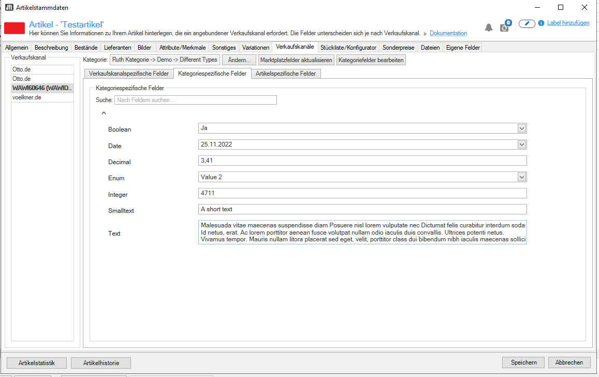

> The key words "MUST", "MUST NOT", "REQUIRED", "SHALL", "SHALL NOT", "SHOULD", "SHOULD NOT", "RECOMMENDED",  "MAY", and "OPTIONAL" in this document are to be interpreted as described in RFC 2119.

# Dev-Guide

With the JTL-Channel API, you can:

-  Describe connected marketplace data structure by providing category and attribute data
-  Manage product and offer listings
-  Update price and quantity of a listing
-  Manage orders
-  Manage the post-order process (returns, refunds)

Target Audience:

- Marketplaces who wanting to connect with sellers who use JTL-Software with an eazyAuction subscription
- Software developers who want to connect to a marketplace

## Terminology

- **Channel**: A channel is defined as a connection to a marketplace or any external system which can be connected to the JTL-Channel API.
- **Seller**: A seller is a person identified by a unique ID (SellerId) who wants to offer and sell his goods on the connected Channel.
- **Event**: An Event is an action initiated from a seller. A channel need to react to events in order to create or update a listing or to process post order actions.
- **Seller API**: This is the Channel API counterpart. The ERP system JTL-Wawi is connected with the Seller API.

## Development cycle

Sandbox: https://scx-sbx.api.jtl-software.com
Production: https://scx.api.jtl-software.com 

### Prerequisite

To access the JTL-Channel API you will need an API refresh token. These token are created during the onboarding process 
together with JTL. If you are interested to connect your marketplace with the JTL ecosystem, please do not hesitate to contact us.

https://www.jtl-software.de/kontakt

### Development

The Channel implementation runs on your own infrastructure. You as the Channel integrator have the full responsibility to 
run, manage and secure your application.

## Error Handling

Error responses are indicated by an HTTP status code >=400. The Channel API uses a consistent error response format for all API errors.

```json
{
    "errorList": [
        {
            "code": "VAL100",
            "message": "orderList[0].sellerId: SellerId darf nicht leer sein und maximal 50 alphnumerische Zeichen beinhalten",
            "severity": "error",
            "hint": null
        },
        {
            "code": "VAL100",
            "message": "orderList[0].orderStatus: Ungültiger oder unbekannter Order Status. Muss einer der folgenden Werte sein UNACKED, CREATED, ACCEPTED, SHIPPED, PARTIALLY_SHIPPED, CANCELED_BY_SELLER, CANCELED_BY_BUYER",
            "severity": "error",
            "hint": null
        },
        {
            "code": "VAL100",
            "message": "orderList[0].orderStatus: Ungültiger oder unbekannter Order Status. Muss einer der folgenden Werte sein UNACKED, CREATED, ACCEPTED, SHIPPED, PARTIALLY_SHIPPED, CANCELED_BY_SELLER, CANCELED_BY_BUYER",
            "severity": "error",
            "hint": null
        }
    ]
}
```

We are supporting language `de` (German) as default. This can be changed to `en` by setting the `Accept-Language` header.

## Authorization

To request an access token, use the following cURL command:

```bash
curl -XPOST '/v1/auth' --form 'refreshToken=YOUR-REFRESH-TOKEN'
```

The response will be a JSON object containing the following fields:

```json
{
  "scope": "CHANNEL",
  "authToken": "eyJ0eXAi....",
  "tokenExpireAt": "2024-05-14T10:07:42+02:00",
  "expiresIn": 3600
}
```

* scope: The scope of the access token. In this case, it is "CHANNEL".
* authToken: The token to be used for authenticating further requests.
* tokenExpireAt: The expiration date and time of the token in ISO 8601 format.
* expiresIn: The time in seconds until the token expires (TTL - Time To Live).

Use the authToken received from the above response as a Bearer Token in the `Authorization` header for all further requests.

Example:

```bash
curl --location --request POST '/v1/seller/channel/MYCHANNEL' \
--header 'Authorization: Bearer eyJ0eXAi....'
```

**Important Note**
The authToken has a TTL (Time To Live). Make sure to respect this to avoid rate limiting. 
This means you should monitor the `expiresIn` value and refresh the token moments before it expires to 
maintain uninterrupted access.

## Rate Limiting

API Rate Limiting is the practice of restricting the number of requests a user can make to an API within a given timeframe. 
This ensures fair usage by preventing any single user from overloading the system, which can degrade the API's performance for others. 
Rate limiting is essential for maintaining optimal service operation, protecting against abusive traffic patterns such as DDoS attacks, 
and managing server resources efficiently.

In general API calls are limited. Exceeding the rate limit results in an HTTP 429 "too many requests" error. 
For some endpoints the rate limit is lower to ensure the best quality for all API users.

### Best Practice

Distribute your requests evenly over time and avoid sending large volumes of data simultaneously. 
Adhere to the designated limits for each interface. Doing so prevents congestion in our systems and maintains a 
seamless experience for all users. Please refer to the X-RateLimit-Limit, X-RateLimit-Interval-Length-Seconds and X-RateLimit-Remaining
response headers to monitor your current usage against the established limits. These headers provide real-time information on your quota, 
how many requests you have left, and when the limit will reset, respectively.

### Limits (Production)

| API Route Pattern                                  | Requests                      | Interval (Seconds) |
|----------------------------------------------------|-------------------------------|--------------------|
| Default                                            | 10                            | 60                 |
| /v[version]/channel*                               | 60                            | 60                 |
| /v[version]/channel/order*                         | 600                           | 60                 |
| /v[version]/channel/event*                         | 240                           | 60                 |
| /v[version]/channel/offer*                         | 1500                          | 60                 |
| /v[version]/channel/attribute/category*            | 86400                         | 86400              |
| /v[version]/channel/attribute/global*              | 10                            | 3600               |
| /v[version]/channel/categories*                    | 10                            | 3600               |
| /v[version]/channel/categories*                    | 10                            | 3600               |
| /v[version]/channel/categories*                    | 5                             | 1800               |

Rate Limits on Sandbox environment are different. Please refer to the X-RateLimit-Limit, 
X-RateLimit-Interval-Length-Seconds and X-RateLimit-Remaining.

### Setup of a local JTL-Wawi instance

It may be helpful to use the JTL-Wawi ERP System during development to create new listings or manage orders. 

To connect the ERP System with the sandbox environment install a JTL-Wawi Version 1.8+. 

Connect to  MSSQL Server directly 

Add the seller's refresh token - the token will be created during onboarding process.

```sql
INSERT INTO SCX.tRefreshToken 
(cRefreshToken, nType)
VALUES 
(N'<SellerAPI-RefreshToken>', 1);
```

Switch API Host to Sandbox

```sql
UPDATE dbo.tOptions 
SET cValue ='https://scx-sbx.api.jtl-software.com)' 
WHERE ckey = 'SCX.URL'
```

Restart JTL-Wawi

### Using the Seller-API directly

To test workflows and to send test data to the channel API, you can directly use the Seller API. 
Please see the technical documentation and our Postman Collection in.

## Seller Management

A channel must manage seller accounts autonomously. JTL will never be aware of any credentials required by an 
individual seller to connect to a Marketplace or an external system (including API credentials).

Each channel must maintain a sign-up URL and an update URL. The sign-up URL must point at a login page and the update 
URL at a sign-up page, both hosted by the channel itself. A seller will create a sign-up or update session in JTL-Wawi. 
From there, they will be redirected to the sign-up and update URLS hosted by the channel and receive a unique one-time 
session ID.session ID


### Seller sign-up

The aim of the sign-up process is to avoid managing sensitive access data to a marketplace within the client 
environment or SCX. The channel itself has sovereignty over the access data to the connected marketplace.

- Channel has a sign-up URL
- A sign-up is initiated via the Seller API
- The seller's JTL-Wawi redirects to the sign-up URL (via web browser).
- The destination of the sign-up URL is a website hosted by the channel. On this website the registration process takes place
- The channel authenticate and stores a new seller and assigns a unique Seller ID.
- The channel reports the generated Seller ID together with the Session ID back to SCX.
- SCX stores the Seller ID to the channel and reports all events with this Seller ID to the channel from now on.

### SignUp Example

Create a new SignUp Session ID

```json
// POST /v1/seller/channel/MYCHANNEL
{
  "signUpUrl": "https://www.mychannel.com/?session=demoSessionId123&expiresAt=1646759360",
  "expiresAt": 1646759360
}
```

Seller is now redirected to the `signUpUrl`.

On the sign-up page, the channel must ask for seller identification. If a seller is deemed valid and authenticated,
the Channel itself must create a unique Seller ID and send it, along with the Session ID, from the sign-up URL to the Channel API.

**_Note_**: All events received from the Channel API will have this Seller ID.
This Seller ID is immutable and cannot be changed afterwards.

```json
// POST /v1/channel/seller 

{
  "session": "demoSessionId123",
  "sellerId": "1",
  "companyName": "JTL-Software-GmbH"
}
```

### Seller Update

Sometimes, it may be necessary to update the connection between a JTL account and the seller. For example, the access 
data pertaining to the marketplace may have been changed. In cases like this, the JTL account must be able to update 
this data on the channel.

- An update URL has been defined for the channel.
- The update process is initiated using the Seller API.
- The client of the JTL account (JTL-Wawi) redirects the user to the update URL.
- The target of the update URL is a website hosted by the channel. On this website the update process takes place.
- The channel asks SCX which seller ID belongs to the current update Session ID.
- The channel enables an update of the seller account.
- After the update process, the channel can also update the seller on the SCX system.


### Update examples

Seller update process in initiated by creating an update URL for the Channel

```json
// PATCH /v1/seller/channel/MYCHANNEL?sellerId=1
 
{
  "updateUrl": "https://www.mychannel.com/update?session=demoUpdateSessionId123&expiresAt=1646759360",
  "expiresAt": 1646759360
}
```

The seller is then redirected to the update URL by the channel and receives a one-time session ID.

For security reasons, the seller ID is not part of the update URL and must be received through a separate call.

```json
// GET /v1/channel/seller/update-session?sessionId=demoUpdateSessionId123

{
  "sellerId": "1"
}
```

After the update workflow is handed, the Channel may now update the Seller at Channel API.

```json
// PATCH /v1/channel/seller


{
  "sessionId": "demoUpdateSessionId123",
  "isActive": true,
  "companyName": "JTL-Software-GmbH"
}
```

### Seller unlink

There are different scenarios when a Seller reach a state where he is forbidden to use a Channel.

- Sellers deactivate the connection on their own behalf.
- Seller does not have an active JTL-eazyAuction subscription to use the SCX system.

In this scenario, as the channel, you receive a `Seller:Channel.Unlinked` event.

```json
{
  "sellerId": "1",
  "reason": "deactivated by Seller",
  "unlinkedAt": "2024-02-13T06:00:00+0000",
  "permanentlyRemoved": false
}
```

We recommend that you deactivate a Seller in your system. SCX will not accept any more data for that seller ID until the 
seller initiates a seller update process as described above. You should not delete a Seller ID from your system 
if `permanentlyRemoved` is set to `false`.

When the `permanentlyRemoved` property is set to `true`, the Seller ID is completely removed from the 
SCX system and is no longer known, so you can delete the Seller ID on your end as well.

There are scenarios where you need to unlink a seller ID on your behalf. 

* API credentials become invalid or are revoked, requiring you to reauthorize the Seller ID
* Seller does not have an active contract or subscription with your company
* There is suspicious behavior on your end, and you want to stop the seller's activity.

You can do that by sending a `DELETE /v1/channel/sellerId/{sellerId}` request. 
Do not delete the seller ID in your system until you receive a `Seller:Channel.Unlinked` event 
with `"permanentlyRemoved": true`.

## Events

Two important components of SCX are seller and channel events. Seller events are triggered by a seller integration such 
as JTL-Wawi, while channel events are triggered by a channel integration. Such events are actions created by an actor 
(either a seller or a channel) and may be handled by connected integrations.

A channel integration needs to handle the various seller events provided by `GET /v1/channel/events` in order to create n
ew listings, and mark orders as paid or shipped.

We recommend calling the seller event endpoint at regular intervals (such as once a minute) and consuming all events 
available.

When an event is consumed, it must be acknowledged by calling `DELETE /v1/channel/events`. Otherwise, the event will be 
transmitted again after a timeout.

An event will be transmitted a maximum of 10 times. Afterwards it will be marked as a dead-letter and will 
not be transmitted again.

### Event Examples

Receive Seller events

```json
// GET /v1/channel/event

{
    "eventList": [
        {
            "id": "63623b997d2c89a4e3e9f3c7",
            "event": {
                "channel": "WAWIDEV001",
                "sellerId": "EA4590MitName"
            },
            "createdAt": "2022-11-02T09:42:49+00:00",
            "type": "Seller:Meta.SellerAttributesUpdateRequest"
        },
        {
            "id": "636280fd498628e9f0b28984",
            "event": {
                "sellerId": "1",
                "offerId": 822,
                "channelCategoryId": "CAT7",
                "quantity": "0",
                "taxPercent": "19",
                "priceList": [
                    {
                        "id": "B2C",
                        "quantityPriceList": [
                            {
                                "quantity": "1",
                                "amount": "19.99",
                                "currency": "EUR"
                            }
                        ]
                    }
                ],
                "title": "Fahrrad Halterung",
                "channelAttributeList": [
                    {
                        "attributeId": "WAWI-61427_number_category",
                        "value": "954",
                        "group": "0"
                    }
                ],
                "sku": "843609"
            },
            "createdAt": "2022-11-02T14:38:53+00:00",
            "type": "Seller:Offer.New"
        }
	]
}
```

Acknowledge previous received events.

```json
// DELETE /v1/channel/event

{
    "eventIdList": [
	    "63623b997d2c89a4e3e9f3c7",
        "636280fd65a66c4430ec0d67"
    ]
}
```

## Listing Process

Within the SCX context, there is no concept of a product catalogue. Only listing data is transmitted via the SCX interface. 
This can, however, also contain detailed product data, if required by the channel.

A channel must provide descriptive data to describe what a listing may look like on a connected marketplace.

### Prices Types

There must be at least one price type available to create a listing on a connected marketplace. 
Examples of price types are B2C or B2B prices.

### API Example

```json
// POST https://scx-sbx.api.jtl-software.com/v1/channel/price

{
  "priceTypeId": "MarketplaceTypeId",
  "displayName": "Marketplace Price",
  "description": "Selling price on Marketplace"
}
```

The `priceTypeId` will be transmitted with the `Seller:Offer.New` or `Seller:Offer.Update` seller events. 

```json
{
  "sellerId": "1",
  "offerId": 4711,
  "channelCategoryId": "Stuff",
  "quantity": "508.00",
  "taxPercent": "19",
  "priceList": [
    {
      "id": "MarketplaceTypeId",
      "quantityPriceList": [
        {
          "amount": "6.95",
          "currency": "EUR",
          "quantity": "1"
        }
      ]
    }
  ],
  "...": "..."
}
```

## Category Tree

A connected channel may provide a category structure to set specific attributes related to a category.

### Category tree example

The API endpoint is replacing the entire category structure.

```json
// PUT /v1/channel/categories

{
    "categoryList": [
        {
            "categoryId": "1",
            "displayName": "First Category",
            "listingAllowed": false,
            "parentCategoryId": "0"
        },
        {
            "categoryId": "1.1",
            "displayName": "First Leaf Category",
            "listingAllowed": true,
            "parentCategoryId": "1"
        },
        {
            "categoryId": "1.2",
            "displayName": "Second Leaf Category",
            "listingAllowed": true,
            "parentCategoryId": "1"
        }
	]
}
```


## Attributes

Attributes provide a very simple but powerful way of describing a listing for a channel. This allows the channel to 
define all marketplace requirements for a listing by means of attributes. SCX differentiates between three types of attributes. 
Each attribute type shares the same general structure but targets a different use case.

### Global Attributes

Global attributes should be used when data is required for each listing.

### Category Attributes

Category attributes are related to a `categoryId` inside the category structure. JTL-Wawi will display these attributes 
only when the listing is part of a given category.

### Seller Attributes

Seller attributes are global attributes and can be used when a seller requires individual settings for their listings.

### Item-specific Attributes

Item-specific attributes are not specified by the channel but are instead created and transferred by the seller. 
As such, these attributes represent a special type — each attribute must provide a simple, non-schematic, key-value data 
structure. These attributes will be transmitted along with the `channelAttributeList` in each OfferNew or OfferUpdate Event.

These attributes are highly specific and depend on the input of the seller. The channel can use these attributes to 
provide product and listing data.

### Attributes Examples

Attributes with different Types.



```json
// POST /v1/channel/attribute/category/DEMO-TYPES

{
    "attributeList": [
        {
            "attributeId": "DEMO-TYPES_smalltext",
            "displayName": "Smalltext",
            "type": "smalltext"
        },
        {
            "attributeId": "DEMO-TYPES_text",
            "displayName": "Text",
            "type": "text"
        },
        {
            "attributeId": "DEMO-TYPES_integer",
            "displayName": "Integer",
            "type": "integer"
        },
        {
            "attributeId": "DEMO-TYPES_decimal",
            "displayName": "Decimal",
            "type": "decimal"
        },
        {
            "attributeId": "DEMO-TYPES_boolean",
            "displayName": "Boolean",
            "type": "boolean"
        },
        {
            "attributeId": "DEMO-TYPES_enum",
            "displayName": "Enum",
            "type": "enum",
            "values": [
                {"display": "Value 1", "value": "Id1", "sort": 10},
                {"display": "Value 2", "value": "Id2", "sort": 20},
                {"value": "This has no Display"}
            ]
        },
        {
            "attributeId": "DEMO-TYPES_htmltext",
            "displayName": "Html-text",
            "type": "htmltext"
        },
        {
            "attributeId": "DEMO-TYPES_date",
            "displayName": "Date",
            "type": "date"
        },
        {
            "attributeId": "DEMO-TYPES_image",
            "displayName": "Image",
            "description": "Link to Image file",
            "type": "image"
        },
        {
            "attributeId": "DEMO-TYPES_document",
            "displayName": "Document",
            "description": "Link to a Document file",
            "type": "document"
        }
    ]
}
```

Using sections/sub-sections to organize attributes into logical groups


```json
// POST /v1/channel/attribute/category/DEMO-SECTIONS

{
    "attributeList": [
        {
            "attributeId": "DEMO-SECTIONS_WAREHOUS",
            "displayName": "Warehous",
            "type": "smalltext",
            "section": "Shipping",
            "sectionPosition": 100
        },
        {
            "attributeId": "DEMO-SECTIONS_SHIPPING",
            "displayName": "Shipping Group",
            "type": "smalltext",
            "section": "Shipping",
            "sectionPosition": 80
        },
        {
            "attributeId": "DEMO-SECTIONS_LEADTIME",
            "displayName": "Lead time until shipment",
            "type": "integer",
            "section": "Shipping",
            "sectionPosition": 50
        },
        {
            "attributeId": "DEMO-SECTIONS_OFFER_START",
            "displayName": "Start",
            "type": "date",
            "section": "Discount",
            "sectionPosition": 50
        },
        {
            "attributeId": "DEMO-SECTIONS_OFFER_DISCOUNT",
            "displayName": "Discount Value",
            "type": "decimal",
            "section": "Discount",
            "sectionPosition": 100,
            "subSection": "Deduction",
            "subSectionPosition": 100
        },
        {
            "attributeId": "DEMO-SECTIONS_OFFER_DISCOUNT_UNIT",
            "displayName": "Discount Unit",
            "type": "enum",
            "values": [
                {"value": "%"},
                {"value": "EUR"}
            ],
            "section": "Discount",
            "sectionPosition": 100,
            "subSection": "Deduction",
            "subSectionPosition": 90
        }
    ]
}
```


It is also possible to create repeatable attributes if the attribute supports multiple values.


```json
// POST /v1/channel/attribute/category/DEMO-MULTIPLY_ALLOWED
{
    "attributeList": [
        {
            "attributeId": "DEMO-TYPES_isMultipleAllowed",
            "displayName": "Attribute is Multiple Allowed",
            "isMultipleAllowed": true,
            "type": "smalltext"
        }
    ]
}
```

It is also possible to create repeatable attributes if the attribute supports multiple values.


```json
// POST /v1/channel/attribute/category/DEMO-REPEATABLE_SUBSECTIONS

{
    "attributeList": [
        {
            "attributeId": "shipping_carrier",
            "displayName": "Versanddienstleister",
            "type": "enum",
            "values": [
                {
                    "value": "carrierID_2",
                    "display": "Brief",
                    "sort": 1
                },
                {
                    "value": "carrierID_3",
                    "display": "DHL Päckchen",
                    "sort": 2
                },
                {
                    "value": "carrierID_4",
                    "display": "DHL Paket",
                    "sort": 3
                },
                {
                    "value": "carrierID_22",
                    "display": "Kostenloser Download",
                    "sort": 20
                }
            ],
            "section": "Versandkosten",
            "sectionPosition": 2,
            "subSection": "Versandart",
            "subSectionPosition": 10,
            "isRepeatableSubSection": true
        },
        {
            "attributeId": "shipping_cost_nat",
            "displayName": "National",
            "type": "decimal",
            "section": "Versandkosten",
            "sectionPosition": 2,
            "subSection": "Versandart",
            "subSectionPosition": 9,
            "isRepeatableSubSection": true
        },
        {
            "attributeId": "shipping_cost_eu",
            "displayName": "EU",
            "isMultipleAllowed": false,
            "type": "decimal",
            "section": "Versandkosten",
            "sectionPosition": 2,
            "subSection": "Versandart",
            "subSectionPosition": 8,
            "isRepeatableSubSection": true
        },
        {
            "attributeId": "shipping_cost_int",
            "displayName": "International",
            "isMultipleAllowed": false,
            "type": "decimal",
            "section": "Versandkosten",
            "sectionPosition": 2,
            "subSection": "Versandart",
            "subSectionPosition": 7,
            "isRepeatableSubSection": true
        }
    ]
}
```

When using repeatable sections, JTL-Wawi generates a group ID, which is then transferred back to the channel with the 
listing. This makes it possible to recognize related attributes in the listing data.

```json
// GET /v1/channel/event

{
  "type": "Seller:Offer.New",
  "sellerId": "1",  
  "offerId": 1,  
  "channelCategoryId": "DEMO-REPEATABLE_SUBSECTIONS", 
  "channelAttributeList": [  
    {  
      "attributeId": "shipping_carrier",  
      "value": "DHL Paket",  
      "group": "1"  
    },  
    {  
      "attributeId": "shipping_cost_nat",  
      "value": "2.99",  
      "group": "1"  
    },  
    {  
      "attributeId": "shipping_cost_eu",  
      "value": "2.99",  
      "group": "1"  
    },  
    {  
      "attributeId": "shipping_cost_int",  
      "value": "9.99",  
      "group": "1"  
    },
    {  
      "attributeId": "shipping_carrier",  
      "value": "Brief",  
      "group": "2"  
    },  
    {  
      "attributeId": "shipping_cost_nat",  
      "value": "1.20",  
      "group": "2"  
    },  
    {  
      "attributeId": "shipping_cost_eu",  
      "value": "2.40",  
      "group": "2"  
    },  
    {  
      "attributeId": "shipping_cost_int",  
      "value": "2.40",  
      "group": "2"  
    },     
  ]  
}
```

## Listings

Listings are transmitted by the `Seller:Offer.New` and `Seller:Offer.Update` event.
Each time the listing data changes, JTL-Wawi will transmit the entire listing again.

### Essentials Properties 

It is generally not necessary to provide attributes for essential data, as each listing already implements a set of 
essential properties by default, including a title, description, GTIN, quantity and price.

### Pictures / Images

Product or listing images are transmitted as a link along with the listing event. These links have a lifetime of 7 days 
after the listing event was triggered. The filename is generated based on the file content; i.e., each separate image 
will have a filename similar to its file content.

### Listing State


We highly recommend informing the seller about the processing status of their listings. Most marketplaces use an 
asynchronous listing process during which the listing data is curated in a semi-automated process — a process which may take some time.

#### Status: In-Progress

Send this status to inform the seller that the listing process is now in progress for their listing.

```json
// POST /v1/channel/offer/in-progress

{
	"offerList": [
		{
            "offerId": 1,
			"sellerId": "1",
            "startedAt": "2022-11-28T01:00:13+00"
		}
	]
}
```

#### Status: Successful

We recommend informing the seller once a listing is successfully listed on the connected marketplace. 
The optional `listingUrl` is useful in this case and allows the seller to visit and thereby directly check the listing on the connected marketplace.

```json
// POST /v1/channel/offer/listed

{
	"offerList": [
		{
			"sellerId": "1",
			"offerId": 1,
			"listedAt": "2022-11-28T01:00:13+00",
			"listingUrl": "https://marketplace.de/offer1",
			"channelOfferId": "AFGHDHDFH"
		}
	]
}
```

#### Status: Failed

You need to inform the seller if the listing process for a listing failed.

```json
// POST v1/channel/offer/listing-failed

{
	"offerList": [
		{
			"sellerId": "1",
			"offerId": 1,
			"errorList": [
				{
					"code": "123",
					"message": "A listing error occur",
					"longMessage": "A serious listing error occure."
				}
			],
			"failedAt": "2019-02-09T05:33:12+00:00"
		}
	]
}
```

## Order Process

* A new order must be created by calling `POST /v1/channel/order` first
* The purchase date of an order must be after the creation date of the seller ID
* The orderId is unique, and can only exist once for a seller ID
* It is not possible to add or change order lines once an order has been created.
* Once an order is created, it can be updated using
  * `PUT /v1/channel/order/status` to update the status of an order or order item
  * `PUT /v1/channel/order/address-update` to update the address information

### Order Status

* `CREATED`: Orders with the status “created” are not yet ready for shipping. Orders with this status can be used for stock reservation. Once the order is ready for shipping, the status will change to `ACCEPTED`.
* `UNACKED`: Orders with this status are not yet ready for shipping. The seller must first accept the order. **_Note_**: JTL-Wawi does not yet support order acknowledgment.
* `ACCEPTED`: Orders with the status “accepted” are ready for shipping.

### Order line item Status

Each order line item has a status, and this status should be used to determine the order status itself.

* `UNSHIPPED`: The order line item is ready for shipping and can be shipped once the order is `ACCEPTED`.
* `SHIPPED`: The order line item is marked as having been shipped.
* `CANCELED_BY_SELLER`: The order line item has been cancelled by the seller.
* `CANCELED_BY_BUYER`: The order line item has been cancelled by the buyer or the marketplace.
* `RETURNED`: The order line item has been returned to the seller.
* `REFUNDED`: The order line item has been refunded.

### Status transition limitations and rules

* Orders with the statuses `UNACKED` or `CREATED` may not have valid address information.
* An address update can only apply to orders with the statuses `UNCACKED` or `CREATED`.
* Address information must be available before a status transition to `ACCEPTED`.
* Once an order is assigned the status `ACCEPTED`, the order status cannot be changed.

The order item status can convey the following status information:

| Stauts             | UNSHIPPED | SHIPPED | CANCELED_BY_SELLER | CANCELED_BY_BUYER | RETURNED | REFUNDED |
|--------------------|-----------|---------|--------------------|-------------------|----------|----------|
| UNSHIPPED          | ✓         | ✓       | ✓                  | ✓                 | ✓        | ✓        |
| SHIPPED            | -         | ✓       | ✓                  | ✓                 | ✓        | ✓        |
| CANCELED_BY_SELLER | -         | -       | ✓                  | -                 | -        | -        |
| CANCELED_BY_BUYER  | -         | -       | -                  | ✓                 | -        | -        |
| RETURNED           | -         | -       | -                  | -                 | ✓        | ✓        |
| REFUNDED           | -         | -       | -                  | -                 | -        | ✓        |

### API Examples

Create a `CREATED` order using

```json
// `POST 'https://scx-sbx.api.jtl-software.com/v1/channel/order`

{
  "orderList": [
    {
      "sellerId": "1",
      "orderStatus": "CREATED",
      "orderId": "OrderId_000001",
      "purchasedAt": "2020-02-25T15:05:20+00:00",
      "lastChangedAt": "2020-02-25T15:05:20+00:00",
      "currency": "EUR",
      "orderItem": [
        {
          "orderItemId": "SHIPPING-0001",
          "type": "SHIPPING",
          "grossPrice": "2.00",
          "taxPercent": "19",
          "quantity": "1.0",
          "shippingGroup": "test"
        },
        {
          "orderItemId": "ABC-0001",
          "type": "ITEM",
          "grossPrice": "19.99",
          "total": "19.99",
          "taxPercent": "19",
          "sku": "1234",
          "channelOfferId": "1",
          "quantity": "1",
          "title": "Eine Hose (4006680069951)",
          "note": "Zur Auswahl"
        },
        {
          "orderItemId": "ABC-0002",
          "type": "ITEM",
          "grossPrice": "19.99",
          "total":"19.99",
          "taxPercent":"19",
          "sku": "ART-WAWI-55070",
          "channelOfferId": "2",        
          "quantity": 1,
          "title": "Ein Hemd (ART-WAWI-55070)",
          "note": "Zur Auswahl"          
        }
      ]
    }
  ]
}
```

Send address information for an order with the status `CREATED`

```json
// PUT 'https://scx-sbx.api.jtl-software.com/v1/channel/order/address-update

{
    "orderList": [
        {
            "orderId": "OrderId_000001",
            "sellerId": "1",
            "billingAddress": {
                "firstName": "Arno",
                "lastName": "Nym",
                "gender": "male",
                "street": "Am Feld",
                "houseNumber": "16",
                "postcode": "123456",
                "city": "Dingenskirschen",
                "country": "DE"
            },
            "shippingAddress": {
                "firstName": "Arno",
                "lastName": "Nym",
                "gender": "male",
                "street": "Am Feld",
                "houseNumber": "16",
                "postcode": "123456",
                "city": "Dingenskirschen",
                "country": "DE"
            }
        }
    ]
}
```

Update order and set status to `ACCEPTED`

```json
// PUT 'https://scx-sbx.api.jtl-software.com/v1/channel/order/status

{
	"orderList": [
		{
			"orderId": "OrderId_000001",
			"sellerId": "1",
			"orderStatus": "ACCEPTED"
		}
	]
}
```

Send a status change for an order line items

```json
// PUT 'https://scx-sbx.api.jtl-software.com/v1/channel/order/status

{
	"orderList": [
		{
			"orderId": "OrderId_000001",
			"sellerId": "1",
			"orderStatus": "ACCEPTED",
			"orderItems": [
                {
                    "orderItemId": "ABC-0001",
                    "itemStatus": "SHIPPED",
                    "paymentStatus": "PAID"
                },
                {
                    "orderItemId": "ABC-0002",
                    "itemStatus": "SHIPPED",
                    "paymentStatus": "PAID"
                }
            ]
		}
	]
}
```

## Post-Order Processes

### Cancellation (by Seller)


- Sellers send a cancellation request together with a `CancellationRequestId` which the client, i.e., JTL-Wawi, should remember in order to be able to assign the response later on.
- The `CancellationRequestId` is used for the unique assignment of the data (OrderId / OrderItemIDs) to the client.
- A cancellation should always include all items to be cancelled. If the entire order is cancelled, all order items included in the order must be specified. However, if only part of the order is cancelled, only the cancelled items must be specified.

### Cancellation (by Buyer/Marketplace)


- Buyers or marketplaces send a cancellation request together with a `CancellationRequestId`.
- The `CancellationRequestId` is used for the unique assignment of the data (OrderId / OrderItemIDs) to the channel.
- A cancellation should always include all items to be cancelled. If the entire order is to be cancelled, all order items contained must also be specified. It is also possible to have partial order cancellations if only some individual items are cancelled.
- Using this workflow on the channel side is considered optional- it is also possible to set the order status to “cancel”.

### Return


#### Channel informs about upcoming return event

**_Note_**: This is an optional step in the workflow. Not all marketplaces support a return announcement.

- Via the `Channel:Order.Return` event, the channel reports that a return process has been initiated on a connected marketplace.
  - The following data is provided:
    - OrderId
    - OrderItem List (ItemId, Quantity, Reason, Comment)
  - The following data can be provided optionally by the channel:
    - ChannelReturnId - internal ID to identify the return case
    - Return Tracking Information (Carrier, TrackingNo.)
- JTL-Wawi stores the upcoming return case
	- If no item return is required, the return can be answered directly via `POST /v1/seller/order/return`.
	- If a return is required, the seller now waits for the incoming return.

### (Optional) Merchant decides that no return is required

**_Note_**: This is an optional step in the workflow.

The seller has the option to decide whether the customer needs to make a return. If no return is required, 
the `POST /v1/seller/order/return` can be sent by the seller after receiving the Channel:Order.Return event.
The property `requireReturnShipping` should be set to `false` here.

### Return shipment arrives at the seller’s warehouse

- Once the return has arrived, the seller will check the items and confirm the return using `POST /v1/seller/order/return`.
- If a return already exists in JTL -Wawi, the information stored there should be used to transfer the return to SCX.
  - This information includes the `channelReturnId`.
- Furthermore, the following information about the individual order items must be transferred:
  - The order number (orderId)
  - The quantity that was returned
  - If the return is accepted (acceptReturn)
  - A condition must be specified
  - A reason can be specified
  - An additional note that can be stored

### Refund


Refunds are initiated directly by the seller, e.g. after a return has been processed or following an agreement with the 
buyer (via ticket/email/phone). The channel processes the refund and sends a `Channel:Order.RefundProcessingResult` 
after a success or failure back to the seller to ensure that a refund has been properly processed.

## Links and other Resources

Channel-API Documentation
https://scx-sandbox.ui.jtl-software.com/docs/api_channel.html

Seller-API Documentation
https://scx-sandbox.ui.jtl-software.com/docs/api_seller.html

Postman Collection
https://www.postman.com/jtl-eazyauction/workspace/jtl-scx-public

JTL-Guide 
https://guide.jtl-software.de/
